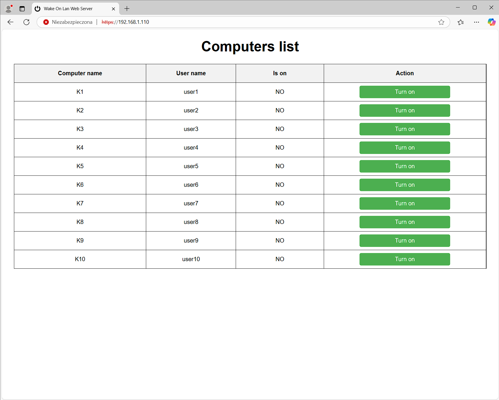

# WakeOnLanWebServer

WakeOnLanWebServer is a cross-platform application designed to manage and monitor computers in a network. It allows users to:

- **Check Computer Availability:** Verify if a computer is online by attempting to connect to a specific port (e.g., port 3389 for Remote Desktop Protocol - RDP).
- **Power On Computers Remotely:** Use the Wake-on-LAN (WOL) protocol to turn on computers that are powered off but have WOL enabled.

The application is designed for both Linux and Windows systems, with deployment options as a systemd daemon on Linux or a Windows service. It provides a web-based interface for easy access, supports SSL/TLS for secure communication, and allows flexible customization of ports, computer lists, and configuration settings.

## Download
| Platform  | Download                                         |
|-----------|-------------------------------------------------------|
| Windows   | [Download Installer EXE](https://github.com/MateuszMurawski/WakeOnLanWebServer/blob/main/INSTALLER_WINDOWS/WakeOnLanWebServer_Installer.exe) |
| Linux (Tested on Ubuntu Server 24)| [Download ZIP](https://github.com/MateuszMurawski/WakeOnLanWebServer/blob/main/INSTALLER_LINUX/WakeOnLanWebServer.zip)         |

## Key Features
- **Cross-Platform Compatibility:** Pre-built binaries for both Linux and Windows platforms ensure ease of deployment.
- **Web-Based Interface:** A simple yet powerful HTML-based interface enables users to interact with the application from any modern browser.
- **Wake-on-LAN Management:** Remotely power on networked computers using their MAC addresses.
- **Status Monitoring:** Quickly check the online/offline status of managed computers using a configurable port.
- **Secure Communication:** Integrated SSL/TLS encryption ensures secure communication between the server and clients.
- **Multi-Threaded Scanning:** Utilize multiple threads to improve the speed and efficiency of status polling.
- **Localized User Interface:** Support for multiple languages (currently English and Polish).
- **Customizable Configuration:** Flexible options for port numbers, paths to SSL certificates, and computer lists.
- **Service Integration:** Run as a systemd daemon on Linux or as a Windows service for continuous operation.

## User Interface
The application features an intuitive web-based interface, accessible from any modern browser. Below is an example screenshot of the interface:



## Project Structure
The project is organized into the following folders:

### 1. **APP_LINUX**
This folder contains all necessary components for deploying the application on Linux systems:
- **CONFIG**: Configuration files for the application.
- **DATA**: Persistent data used by the application.
- **HTML**: Web interface files.
- **LOG**: Log files generated by the application.
- **SSL**: SSL certificates and keys for secure communication.
- **WakeOnLanWebServer**: The binary executable for Linux.
- **WakeOnLanWebServer.service**: A service file to run the application as a systemd daemon on Linux.

### 2. **APP_WINDOWS**
This folder contains all necessary components for deploying the application on Linux systems:
- **CONFIG**: Configuration files for the application.
- **DATA**: Persistent data used by the application.
- **HTML**: Web interface files.
- **LOG**: Log files generated by the application.
- **SSL**: SSL certificates and keys for secure communication.
- **WakeOnLanWebServer.exe:** The binary executable for Windows, which runs the application as a service.

### 3. **CODE**
This folder contains the source code and scripts used to build the binaries for both platforms:
- **CONFIG**, **DATA**, **HTML**, **LOG**, **SSL**: Same as above.
- **WOLWebServer**: Python source code for the project.
- **main_linux.py**: Entry point for building the Linux binary.
- **main_windows.py**: Entry point for building the Windows binary.

### 4. **ICO**
This folder contains the program icon used during the binary generation process.

### 5. **INSTALLER_WINDOWS**
This folder contains the installer for Windows. The installer performs the following tasks:
- Installs the program.
- Configures the application to run as a Windows service.
- Opens necessary ports in the firewall.

Additionally includes an NSIS script to generate custom installers.

### 6. **INSTALLER_LINUX**
This folder contains a zipped archive (WakeOnLanWebServer.zip) with all files from the APP_LINUX folder. The archive simplifies deployment by bundling all necessary components for installation on Linux systems.

---

## Deployment

### Deployment Options
You can deploy the application using one of two methods:

1. **Automated Installer**:
   - For **Windows**: Use the installer from the **INSTALLER_WINDOWS** folder to configure the application automatically.

2. **Manual Setup**:
   - Extract files and configure the service manually as described below.

### 1. Deploying on Linux (Manual Setup Only)
1. Extract the `WakeOnLanWebServer.zip` archive from the **INSTALLER_LINUX** folder to the target system.
2. Move the extracted files to the desired installation directory (e.g., `/opt/WakeOnLanWebServer/`).
3. Copy the `WakeOnLanWebServer.service` file to `/etc/systemd/system/`:
   ```bash
   sudo cp /opt/WakeOnLanWebServer/WakeOnLanWebServer.service /etc/systemd/system/
   ```
4. Edit the service file to ensure correct paths for your setup. Update the following in `WakeOnLanWebServer.service`:
   ```ini
   [Unit]
   Description=Runs the Wake On Lan Web Server as a service
   After=network.target

   [Service]
   ExecStart=/usr/bin/sudo /opt/WakeOnLanWebServer/WakeOnLanWebServer
   WorkingDirectory=/opt/WakeOnLanWebServer/

   Restart=always
   RestartSec=120
   User=root

   [Install]
   WantedBy=multi-user.target
   ```
5. Assign the appropriate permissions to the `WakeOnLanWebServer` binary:
   ```bash
   sudo chmod +x /opt/WakeOnLanWebServer/WakeOnLanWebServer
   ```
6. Reload the systemd daemon to register the service:
   ```bash
   sudo systemctl daemon-reload
   ```
7. Enable the service to start on boot:
   ```bash
   sudo systemctl enable WakeOnLanWebServer
   ```
8. Start the service:
   ```bash
   sudo systemctl start WakeOnLanWebServer
   ```
9. Verify the service status:
   ```bash
   sudo systemctl status WakeOnLanWebServer
   ```
10. Ensure necessary ports (e.g., 80 for HTTP or 443 for HTTPS) are open in the system firewall:
   ```bash
   sudo ufw allow 80
   sudo ufw allow 443
   ```

### 2. Deploying on Windows - Automatic Installation (via Installer)
1. Run the provided installer from the **INSTALLER_WINDOWS** folder.
2. The installer will:
   - Install the program files.
   - Configure the application to run as a Windows service.
   - Automatically open necessary ports in the Windows firewall.
3. After installation, verify the service is running by opening the Services Manager or using the following command in an administrative command prompt:
   ```cmd
   sc query WakeOnLanWebServer
   ```
4. If needed, manually start the service:
   ```cmd
   sc start WakeOnLanWebServer
   ```

### 3. Deploying on Windows - Manual Setup
1. Copy the contents of the **APP_WINDOWS** folder to the desired location on your system (e.g., `C:\Program Files\WakeOnLanWebServer`).
2. Open an administrative command prompt and manually create the service:
   ```cmd
   sc create WakeOnLanWebServer binPath= "\"C:\Program Files\WakeOnLanWebServer\\WakeOnLanWebServer.exe\"" start= demand
   ```
3. Configure the service to start automatically:
   ```cmd
   sc config WakeOnLanWebServer start= auto
   ```
4. Start the service:
   ```cmd
   sc start WakeOnLanWebServer
   ```
5. Verify the service status:
   ```cmd
   sc query WakeOnLanWebServer
   ```
6. Open the necessary ports in the Windows firewall manually using administrative command prompt:
   ```cmd
   netsh advfirewall firewall add rule name="WakeOnLanWebServer HTTPS" dir=in action=allow protocol=TCP localport=443 program="C:\Program Files\WakeOnLanWebServer\WakeOnLanWebServer.exe"
   netsh advfirewall firewall add rule name="WakeOnLanWebServer HTTPS OUT" dir=out action=allow protocol=TCP localport=443 program="C:\Program Files\WakeOnLanWebServer\WakeOnLanWebServer.exe"
   ```
   
---

## Building the Application

### 1. Generating the Windows Binary
To generate the Windows binary:
1. Install **PyInstaller** if not already installed:
   ```bash
   pip install pyinstaller
   ```
2. Run the following command:
   ```bash
   pyinstaller --add-data "WOLWebServer;WOLWebServer" --icon="../ICO/power-off-icon.ico" --hidden-import win32timezone -F --noconsole --name WakeOnLanWebServer main_windows.py
   ```

### 2. Generating the Linux Binary
To generate the Linux binary:
1. Install **PyInstaller** if not already installed:
   ```bash
   pip install pyinstaller
   ```
2. Run the following command:
   ```bash
   pyinstaller --add-data "WOLWebServer:WOLWebServer" --icon="../ICO/power-off-icon.ico" --name WakeOnLanWebServer main_linux.py
   ```

